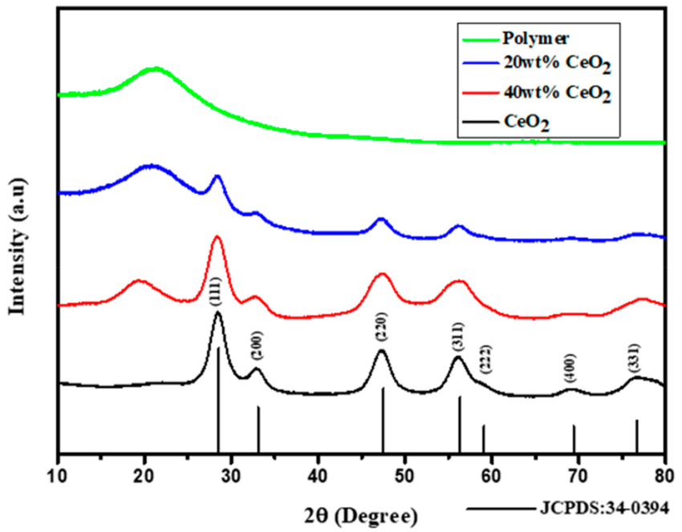

Problem:

XRD as CSVs -> 

1. Based on how the light exits the material, and how intense it is, we try to estimate the structure of the material.
	1. Based on where the peaks are, we know roughly where the atoms are. A thing without structure would be a full horizontal line; the other limit is only the peaks.
  
		

2. Jasmine’s idea: real materials won’t have very clean lines, due to defects in the material.
	1. Separate out the contribution from the defects?

Suppose I output ideal peaks

```json
[
	[28, 0.8],
	[33, 0.4],
	[47, 0.6],
	...
]
```

3. Compute FWHM: full-width half-mass, on each peak.
4. There are multiple reasons why some peaks may be widened. What are those reasons?

Reason contributions:

```json
[
	{"reason 1": 0.475},
	{"reason 2": 0.3},
	...
]
```

5. Many different methods to compute reason contributions via physics-based methods.
	1. Do them all and use the data to do something?


Model:

XRD -> (reason contribution list) (RCL)

---

Big task:

1. Classification: clustering (unsupervised), dog vs. cat (supervised)
2. Regression: weather modeling (supervised), math/CS (unsupervised)

---

Supervised:

1. Set $X$ of inputs
2. Set $Y$ of corresponding outputs that are correct

Unsupervised (RL): given verifier f, where f(y) scores how "close" to correct `y` is, then your model inputs can be

1. Set $X$ of inputs
2. Verifier $f$, which includes a reward function

---

Try regression:

Take labeled dataset (XRD, true RCL).
Transform into dataset (physics based RCLs, true RCL).
Shove the train split into either/both linear regression, support vector machine => optimize all the of the parameters/coefficients in your linear regression/support vector machine.

Then, for test split, run the (physics based RCLs) as input through the linreg/SVM => (proposed RCL).
Compare (proposed RCL) vs. (true RCL) via some score (e.g. cross-entropy).
