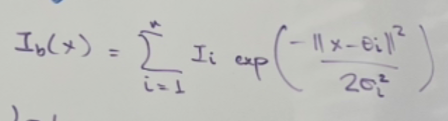

Goal: learn prediction function $\hat f$

$$\hat f: X\to Y$$

such that $\hat f - f$ is minimized over $X$, for a true function $f$.

In this case,

1. $X=$ XRD data, let $x_i\in X\geq 0$,
2. $Y=$ DD (or whatever else), with $y_i\in Y$.

We will consider $\hat f$ of the form

$$\hat f(x)=mx+b=\hat y,\tag{1}$$

so the quantity we want to minimize is

$$Z=\sum_i |\hat y_i - y_i|.$$

From $(1)$, we have

$$\hat y'=m,$$

so, if $\hat y_i>y_i$, then decreasing $m$ will give a $\hat f$ which minimizes $Z$ further.

We propose loss function

$$L(i)=\hat y_i - y_i$$

where

1. $L$ must decrease with better predictions
2. $L$ must inform the direction $m$ should update.

---

More accurately, $X$ is isomorphic to a real vector space e.g.

$$X\cong \mathbb{R}^k,x_i=\begin{bmatrix}
r_1\\
r_2\\
\ldots\\
r_k
\end{bmatrix}$$

and $m$ is a matrix in $k\times l$, where $l$ is the dimension of the output space $Y\cong \mathbb{R}^l$.

---

1. $I_b(x)$ is defined over $x$ degrees.
2. $I_b(x)$ is much larger near a peak, and much smaller elsewhere.
3. Peaks where are close together amplify their effects in this function.
4. All peaks are scaled by some $\sigma_i$ factor. Not sure why.
5. Peaks which are far apart seem not to be changed much.

Personal take:

$I(x)$, $I_b(x)$, and $I_{sb}(x)$ are transformations over the original XRD data that take into account two things:
	1. Peak co-interference.
	2. Some theoretical results on the peaks (somehow represented through $\Delta I_i$).

Perhaps the way to take $I\to X\cong R_k$ is to let

$$x_i=\begin{bmatrix}
r_1=I_{sb}(\theta_1)\\
r_2=I_{sb}(\theta_2)\\
\ldots\\
r_n=I_{sb}(\theta_n)
\end{bmatrix}$$

but maybe there’s a smarter way to do this that loses less about $I_{sb}(x)$.
